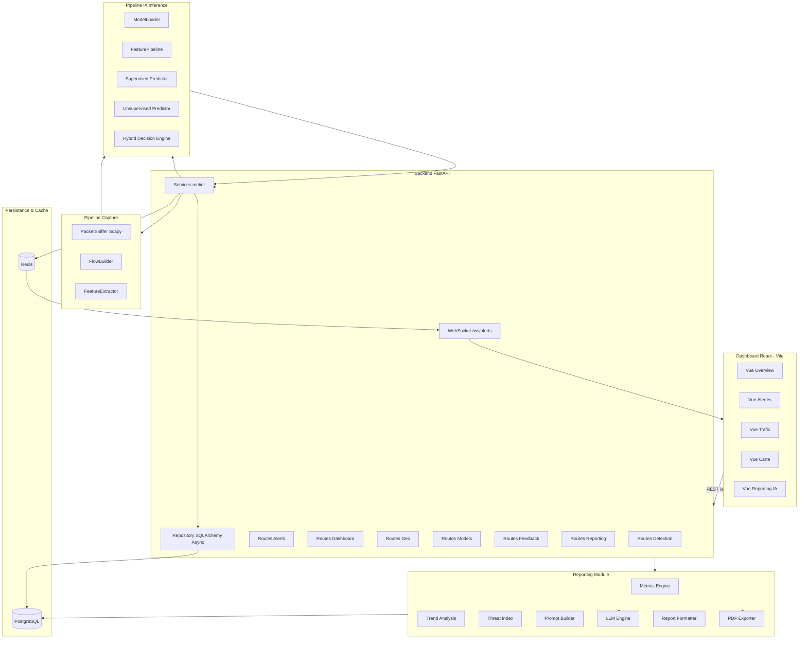
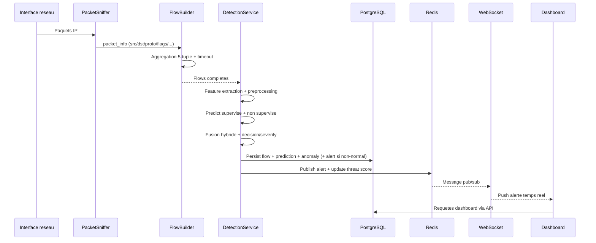
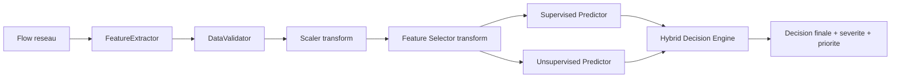
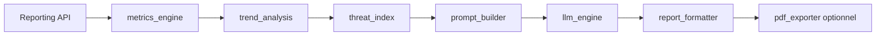
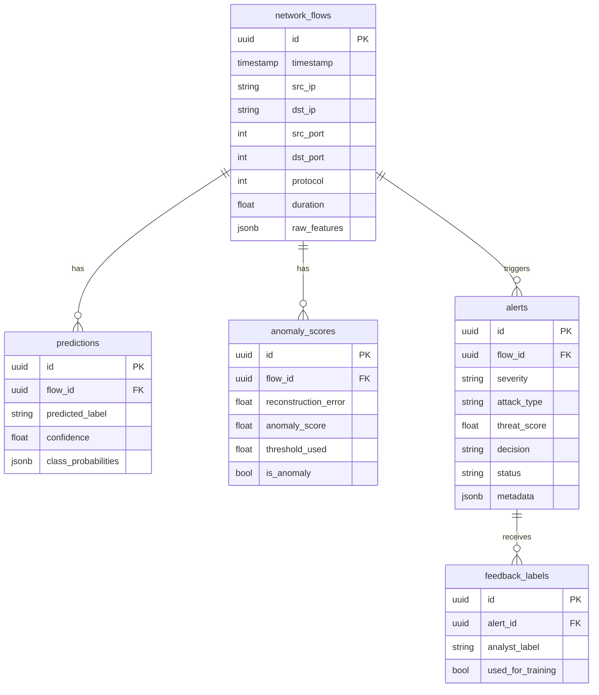

# 🛡️ Network Defense System (NDS)

Plateforme SOC (Security Operations Center) orientée **détection d’intrusions réseau en temps réel**, combinant :
- une chaîne de **capture/agrégation de flux réseau**,
- un pipeline **IA hybride d’inférence uniquement** (supervisé + non supervisé + réputation IP),
- un backend **FastAPI asynchrone**,
- un dashboard React temps réel,
- un module de **reporting intelligent piloté par LLM**.


---

## Table des matières

- [1. Positionnement et périmètre](#1-positionnement-et-périmètre)
- [2. Architecture système complète](#2-architecture-système-complète)
- [3. Structure du dépôt](#3-structure-du-dépôt)
- [4. Stack technologique réelle](#4-stack-technologique-réelle)
- [5. Flux de données opérationnel](#5-flux-de-données-opérationnel)
- [6. Pipeline IA (inférence uniquement)](#6-pipeline-ia-inférence-uniquement)
- [7. Module Reporting LLM](#7-module-reporting-llm)
- [8. Schéma de données et persistance](#8-schéma-de-données-et-persistance)
- [9. API backend (routes exposées)](#9-api-backend-routes-exposées)
- [10. Dashboard React (vues et intégration)](#10-dashboard-react-vues-et-intégration)
- [11. Sécurité, gouvernance et contraintes](#11-sécurité-gouvernance-et-contraintes)
- [12. Installation et exécution](#12-installation-et-exécution)
- [13. Configuration environnement](#13-configuration-environnement)
- [14. Observabilité et exploitation](#14-observabilité-et-exploitation)
- [15. Limites connues et axes d’amélioration](#15-limites-connues-et-axes-damélioration)
- [16. Documentation complémentaire](#16-documentation-complémentaire)
- [17. Licence](#17-licence)

---

## 1. Positionnement et périmètre

### 1.1 Objectif principal

Le projet NDS vise la **détection continue d’activités réseau malveillantes** via un moteur décisionnel hybride, avec restitution SOC orientée exploitation :
- alerting en quasi temps réel,
- visualisation consolidée (threat score, timeline, carte d’attaque, distributions),
- génération de rapports analytiques (JSON / Markdown / PDF) enrichis par LLM.

### 1.2 Portée fonctionnelle actuelle

- **Capture réseau** via Scapy (thread dédié + buffer circulaire).
- **Construction de flux bidirectionnels** (5-tuple canonique) avec timeout.
- **Extraction de features CIC-compatibles** (~80 variables statistiques).
- **Prétraitement IA** : validation → scaling → feature selection.
- **Inférence supervisée** (classification multi-classe).
- **Inférence non supervisée** (autoencodeur + erreur de reconstruction).
- **Fusion hybride** (poids configurés + réputation IP).
- **Persistance transactionnelle** en PostgreSQL (flows, scores, alertes, feedback).
- **Diffusion temps réel** des alertes via Redis Pub/Sub → WebSocket.
- **Reporting SOC assisté LLM** avec export multi-format.

### 1.3 Hors périmètre applicatif direct

- L’entraînement des modèles **n’est pas exécuté dans cette application**.
- Le projet charge exclusivement des artefacts pré-entraînés déposés dans `ai/artifacts/`.

---

## 2. Architecture système complète



### 2.1 Principes d’architecture observés

- **Séparation nette des couches** : API / Services / Repository / Capture / IA / Reporting.
- **Asynchronisme backend** : FastAPI + SQLAlchemy async + Redis async.
- **Tolérance aux indisponibilités** : fallbacks sur DB/Redis/Geo/LLM selon modules.
- **Conception orientée production** : healthcheck, scheduler de rétention, dockerisation DB/Redis.

---

## 3. Structure du dépôt

```text
Network-Defense-System/
├── ai/                              # IA inférence uniquement
│   ├── artifacts/                   # Modèles et objets de preprocessing exportés
│   ├── config/model_config.py       # Chemins artefacts + seuils/poids inférence
│   ├── inference/
│   │   ├── model_loader.py
│   │   ├── supervised_predictor.py
│   │   ├── unsupervised_predictor.py
│   │   └── hybrid_decision_engine.py
│   └── preprocessing/
│       ├── data_validator.py
│       └── feature_pipeline.py
├── backend/
│   ├── main.py                      # FastAPI app, lifecycle, middlewares, routes
│   ├── api/                         # Endpoints REST/WebSocket
│   ├── core/                        # Config, sécurité, exceptions métier
│   ├── database/                    # Connexion, ORM, repository, Redis client
│   │   └── migrations/initial_schema.sql
│   └── services/                    # Logique métier (detection, capture, alert, geo...)
├── capture/                         # Sniffer + flow builder + extraction features
├── geo/                             # Classification IP + geolocalisation ip-api
├── reporting/                       # Pipeline reporting + LLM + export PDF/MD/JSON
├── monitoring/                      # Logging centralisé + métriques système
├── dashboard/                       # Frontend React/Vite
├── docs/                            # Problématique, entraînement, guide utilisateur
├── docker-compose.yml               # PostgreSQL + Redis + Backend (3 services)
├── Dockerfile                       # Image backend Python
├── .dockerignore                    # Exclusions build Docker
├── .env                             # Variables d'environnement
└── requirements.txt                 # Dépendances Python (minimisées)
```

---

## 4. Stack technologique réelle

> Dérivée de l’implémentation effective (`backend/`, `ai/`, `capture/`, `reporting/`, `dashboard/`).

### 4.1 Backend & API

- **FastAPI** (`backend/main.py`) + OpenAPI (Swagger/ReDoc).
- **Pydantic v2 + pydantic-settings** pour la configuration.
- **SlowAPI** (limiter initialisé dans l’application).
- **Uvicorn** comme serveur ASGI.

### 4.2 Persistance et cache

- **PostgreSQL** (schéma SQL initial + ORM SQLAlchemy 2.0 async).
- **asyncpg** pour connexion async.
- **Redis 7** pour :
  - cache opérationnel,
  - compteurs métriques,
  - pub/sub alertes temps réel,
  - threat score global.

### 4.3 IA & Data

- **TensorFlow / Keras** pour les modèles d’inférence.
- **NumPy** pour le calcul vectoriel.
- **joblib** pour les objets de preprocessing (`scaler`, `encoder`, `feature_selector`, `threshold_stats`).
- **Scikit-learn artefacts** chargés côté inférence.

### 4.4 Capture et réseau

- **Scapy** pour sniffing paquets IP/TCP/UDP.
- Thread de capture dédié + buffer circulaire (`collections.deque`).
- Fallback capture (BPF/L2/L3) implémenté dans `packet_sniffer.py`.

### 4.5 Frontend

- **React 18** + **Vite 6**.
- **Recharts** (graphs), **React-Leaflet/Leaflet** (carte), **lucide-react** (icons).
- Proxy dev Vite : `/api` et `/ws` vers backend.

### 4.6 Reporting intelligent

- Pipeline analytique maison (`metrics_engine`, `trend_analysis`, `threat_index`).
- Génération LLM via :
  - **Ollama** (par défaut),
  - ou endpoint compatible OpenAI (`openai.AsyncOpenAI`, ex. Groq).
- Exports : JSON, Markdown, PDF (fpdf2).

### 4.7 Conteneurisation

- `docker-compose.yml` : **3 services** orchestrés (PostgreSQL 16, Redis 7, Backend FastAPI).
- Réseau Docker dédié (`nds-network`) pour communication inter-services par nom DNS.
- Healthchecks sur les 3 services + `depends_on` avec conditions.
- `Dockerfile` backend basé sur `python:3.11-slim` + dépendances système (`libpcap`, `libpq`, `tcpdump`).
- `.dockerignore` pour optimiser le contexte de build.

---

## 5. Flux de données opérationnel



### 5.1 Transactions et persistances

Pour un flux analysé, le backend persiste dans une transaction :
1. `network_flows`
2. `predictions`
3. `anomaly_scores`
4. `alerts` (conditionnel selon décision)

### 5.2 Conditions de génération d’alerte

Une alerte est créée si `decision != "normal"`.

---

## 6. Pipeline IA (inférence uniquement)

### 6.1 Artefacts requis

Répertoire attendu : `ai/artifacts/`

- `model_supervised.keras`
- `model_unsupervised.keras`
- `scaler.pkl`
- `encoder.pkl`
- `feature_selector.pkl`
- `threshold_stats.pkl` *(utilisé par le prédicteur non supervisé ; recommandé)*

### 6.2 Chaîne de traitement



### 6.3 Logique supervisée

Sortie principale :
- `attack_type`
- `probability`
- `is_attack` si :
  - classe prédite ≠ BENIGN/NORMAL/LEGITIMATE,
  - et probabilité ≥ `min_classification_confidence` (config).

### 6.4 Logique non supervisée

- Calcul erreur de reconstruction MSE.
- Seuil dynamique prioritairement lu depuis `threshold_stats.pkl`.
- Si absent : fallback interne (`mean=0.01`, `std=0.005`).
- Score anomalie normalisé à partir du z-score.

### 6.5 Fusion hybride (décision)

Poids par défaut (`ai/config/model_config.py`) :
- supervisé = 0.50
- non supervisé = 0.30
- réputation IP = 0.20

Forme de score :

$$
Risk = w_{sup}\cdot SupRisk + w_{unsup}\cdot AnomalyScore + w_{rep}\cdot Reputation
$$

avec bornage final dans $[0,1]$.

### 6.6 Matrice de décision codée

| is_attack (sup) | is_anomaly (unsup) | Décision résultante |
|---|---|---|
| true | true | `confirmed_attack` |
| true | false | `confirmed_attack` si confiance ≥ 0.8 sinon `suspicious` |
| false | true | `unknown_anomaly` |
| false | false | `suspicious` si risk ≥ threshold_attack sinon `normal` |

### 6.7 Sévérité et priorité

- Sévérité mappée sur le `final_risk_score` (`critical`, `high`, `medium`, `low`).
- Priorité opérationnelle calculée selon couple (sévérité, décision).

---

## 7. Module Reporting LLM

### 7.1 Vue d’ensemble

Le reporting n’est pas un simple export statistique : il orchestre une pipeline complète :
1. extraction métriques période,
2. calcul tendances vs période précédente,
3. calcul `threat_index` (0–100),
4. construction d’un prompt structuré JSON-safe,
5. génération LLM,
6. formatage final (`json` / `markdown` / `pdf`).



### 7.2 Endpoint de génération

`POST /api/reporting/generate`

Paramètres query :
- `period_hours` (ex. 24, 168, 720)
- `detail_level` (`Technical` ou `Executive`)
- `export_format` (`json`, `markdown`, `pdf`)

### 7.3 Fournisseurs LLM supportés

- **Ollama** par défaut (`LLM_PROVIDER=ollama`, endpoint `/api/generate`).
- **API OpenAI-compatible** via `openai.AsyncOpenAI` (ex. Groq).

### 7.4 Structure de sortie attendue du LLM

Le moteur exige un JSON contenant :
- `executive_summary`
- `technical_analysis`
- `attacker_behavior`
- `recommendations`

Fallback robuste appliqué si indisponibilité LLM ou JSON invalide.

---

## 8. Schéma de données et persistance

### 8.1 Tables principales

- `network_flows`
- `predictions`
- `anomaly_scores`
- `alerts`
- `ip_geolocation`
- `model_versions`
- `feedback_labels`

### 8.2 Diagramme relationnel



### 8.3 Politique de rétention

Service actif au démarrage (`data_retention_service`) :
- suppression batchée des flux anciens,
- intervalle configurable,
- option de conservation des flux liés à des alertes.

---

## 9. API backend (routes exposées)

### 9.1 Système

| Méthode | Endpoint | Description |
|---|---|---|
| GET | `/` | Informations service |
| GET | `/health` | Vérification API + DB + Redis |
| WS | `/ws/alerts` | Streaming temps réel des alertes |

### 9.2 Détection et capture (`/api/detection`)

| Méthode | Endpoint | Description |
|---|---|---|
| POST | `/analyze` | Analyse d’un vecteur de features |
| GET | `/status` | État du moteur de détection |
| POST | `/capture/start` | Démarrage capture réseau |
| POST | `/capture/stop` | Arrêt capture réseau |
| GET | `/capture/status` | État capture (paquets/flows/interface) |
| GET | `/capture/interfaces` | Interfaces réseau disponibles |
| POST | `/capture/interface` | Changement interface capture |

### 9.3 Alertes (`/api/alerts`)

| Méthode | Endpoint | Description |
|---|---|---|
| GET | `/` | Liste alertes (filtres + pagination) |
| PATCH | `/{alert_id}/status` | Mise à jour statut alerte |
| GET | `/stats` | Statistiques alertes |
| GET | `/top-ips` | Top IPs attaquantes |

### 9.4 Dashboard (`/api/dashboard`)

| Méthode | Endpoint | Description |
|---|---|---|
| GET | `/overview` | KPI globaux |
| GET | `/attack-distribution` | Répartition types attaques |
| GET | `/top-threats` | Top menaces |
| GET | `/recent-alerts` | Dernières alertes |
| GET | `/metrics` | Compteurs techniques |
| GET | `/traffic-timeseries` | Série temporelle trafic |
| GET | `/protocol-distribution` | Répartition protocoles |

### 9.5 Géolocalisation (`/api/geo`)

| Méthode | Endpoint | Description |
|---|---|---|
| GET | `/locate/{ip}` | Géolocalisation IP unitaire |
| POST | `/locate-batch` | Géolocalisation batch |
| GET | `/attack-map` | Données carte des attaques |
| GET | `/cached` | Cache géolocalisation |

### 9.6 Modèles (`/api/models`)

| Méthode | Endpoint | Description |
|---|---|---|
| GET | `/status` | Présence des artefacts IA |
| GET | `/config` | Paramètres inférence exposés |

### 9.7 Feedback (`/api/feedback`)

| Méthode | Endpoint | Description |
|---|---|---|
| POST | `/` | Soumission feedback analyste |
| GET | `/stats` | Compteur feedback non utilisés |
| GET | `/unused` | Listing feedback à exploiter |

### 9.8 Reporting (`/api/reporting`)

| Méthode | Endpoint | Description |
|---|---|---|
| POST | `/generate` | Génération rapport SOC IA |

⚠️ Le routeur reporting est protégé par `X-API-Key` (`verify_api_key`).

---

## 10. Dashboard React (vues et intégration)

### 10.1 Vues implémentées

- `overview` : KPI, threat score, trafic, alertes, timeline, carte.
- `alerts` : listing alertes.
- `traffic` : volumes + distributions + protocoles.
- `map` : carte des sources d’attaque.
- `reporting` : génération et export de rapports.
- `settings` : écran placeholder.

### 10.2 Intégration backend

- Base API front : `const API_BASE = '/api'`.
- Proxy Vite vers backend (`vite.config.js`) :
  - `/api` -> HTTP backend,
  - `/ws` -> WebSocket backend.

### 10.3 WebSocket temps réel

- Le frontend reçoit les alertes publiées Redis via `/ws/alerts`.
- Ping/Pong client prévu (`ping` -> `pong`).

---

## 11. Sécurité, gouvernance et contraintes

### 11.1 Mécanismes présents

- Validation API key (`X-API-Key`) pour le module reporting.
- CORS configurable (`cors_origins` multi-domaines).
- Limiter SlowAPI initialisé dans l’application.
- Validation stricte des features (NaN/Inf/outliers).
- Filtrage géolocalisation des IP privées/réservées.

### 11.2 Points d’attention

- L’authentification API key n’est pas globalement appliquée à tous les routeurs, uniquement reporting.

- Le routeur reporting exige `X-API-Key` : prévoir son injection côté frontend/proxy pour usage complet en UI.

---

## 12. Installation et exécution

### 12.1 Prérequis

- **Docker Desktop** (obligatoire — orchestre backend + PostgreSQL + Redis).
- **Node.js 18+** (pour le dashboard React).
- Windows : Npcap recommandé pour capture Scapy en local.

### 12.2 Clonage

```bash
git clone https://github.com/meedvfx/Network-Defense-System.git
cd Network-Defense-System
```

### 12.3 Déposer les artefacts IA (optionnel)

Placer les fichiers entraînés dans `ai/artifacts/` (voir `docs/TRAINING_GUIDE.md`).  
Le backend démarre sans modèles (mode dégradé — pas d'inférence IA).

### 12.4 Lancer le backend complet (Docker)

Une seule commande lance PostgreSQL, Redis et le backend FastAPI :

```bash
docker compose up --build -d
```

Vérifier que tout est `healthy` :

```bash
docker compose ps
```

Résultat attendu :

| Conteneur | Port | État |
|---|---|---|
| `nds-postgres` | 5432 | healthy |
| `nds-redis` | 6379 | healthy |
| `nds-backend` | 8000 | healthy |

> Le `docker-compose.yml` utilise `env_file: .env` et surcharge automatiquement `DB_HOST=postgres` et `REDIS_HOST=redis` pour le réseau Docker interne. Aucune configuration manuelle n'est nécessaire.

### 12.5 Lancer le dashboard (Frontend React)

```bash
cd dashboard
npm install
npm run dev
```

Le dashboard sera disponible sur `http://localhost:3000`.  
Le proxy Vite redirige automatiquement `/api/*` vers le backend (`http://localhost:8000`).

### 12.6 Accès

| Service | URL |
|---|---|
| Dashboard React | `http://localhost:3000` |
| API Backend | `http://localhost:8000` |
| Swagger Docs | `http://localhost:8000/docs` |
| ReDoc | `http://localhost:8000/redoc` |
| Health Check | `http://localhost:8000/health` |
| Statut Modèles IA | `http://localhost:8000/api/models/status` |

### 12.7 Commandes utiles

```bash
# Voir les logs en temps réel
docker compose logs -f backend

# Arrêter tous les services
docker compose down

# Arrêter + supprimer les données (reset complet DB)
docker compose down -v

# Reconstruire après modification du code
docker compose up --build -d
```

### 12.8 Mode développement local (sans Docker pour le backend)

Si vous préférez lancer le backend hors Docker (pour le debugging) :

```bash
# 1. Lancer uniquement DB + Redis via Docker
docker compose up postgres redis -d

# 2. Créer et activer l'environnement Python
python -m venv .venv
# Windows:
.\.venv\Scripts\Activate.ps1
# Linux/macOS:
# source .venv/bin/activate

# 3. Installer les dépendances
pip install -r requirements.txt

# 4. Lancer le backend
uvicorn backend.main:app --host 0.0.0.0 --port 8000 --reload
```

> En mode local, `.env` utilise `DB_HOST=localhost` et `REDIS_HOST=localhost` (valeurs par défaut), ce qui est correct.

---

## 13. Configuration environnement

Variables lues par le code (`backend/core/config.py` + `reporting/llm_engine.py`) :

### 13.1 Application

- `APP_NAME`
- `APP_ENV`
- `APP_DEBUG`
- `APP_HOST`
- `APP_PORT`
- `SECRET_KEY`

### 13.2 Base de données

- `DB_HOST`
- `DB_PORT`
- `DB_NAME`
- `DB_USER`
- `DB_PASSWORD`

### 13.3 Redis

- `REDIS_HOST`
- `REDIS_PORT`
- `REDIS_DB`

### 13.4 Capture réseau

- `CAPTURE_INTERFACE`
- `CAPTURE_BUFFER_SIZE`
- `CAPTURE_FLOW_TIMEOUT`

### 13.5 Sécurité API

- `API_KEY`
- `CORS_ORIGINS`
- `RATE_LIMIT_PER_MINUTE`

### 13.6 Rétention

- `RETENTION_ENABLED`
- `RETENTION_FLOWS_DAYS`
- `RETENTION_RUN_INTERVAL_MINUTES`
- `RETENTION_DELETE_BATCH_SIZE`
- `RETENTION_KEEP_ALERTED_FLOWS`

### 13.7 Reporting LLM

- `LLM_PROVIDER` (`ollama`, `groq`, ...)
- `LLM_MODEL`
- `OLLAMA_BASE_URL`
- `${LLM_PROVIDER}_API_KEY` (ex. `GROQ_API_KEY`)

---

## 14. Observabilité et exploitation

### 14.1 Logging

Le module `monitoring/logger.py` fournit :
- console logging,
- fichier principal rotatif,
- fichier erreurs rotatif,
- fichier sécurité (warnings+).

### 14.2 Métriques

`monitoring/metrics.py` expose un collecteur de :
- compteurs (`packets_processed`, `flows_analyzed`, `alerts_generated`, ...),
- jauges (`current_threat_score`, `active_flows`, `buffer_usage`),
- santé système via `psutil` (CPU, RAM, disque, uptime).

### 14.3 Santé applicative

- endpoint `/health` avec checks DB et Redis.
- status capture via `/api/detection/capture/status`.

---

## 15. Limites connues et axes d’amélioration

### 15.1 Limites observées

- Couverture sécurité API partielle (reporting uniquement).
- Frontend reporting sans header `X-API-Key` explicite (à traiter côté intégration).
- Persistances `raw_features` actuellement optionnelles (`None` en écriture de flux dans le path principal).

### 15.2 Axes techniques

- Généraliser authn/authz (RBAC/JWT/API Gateway).
- Ajouter tests d’intégration API/DB/Redis/WS.
- Industrialiser MLOps offline (versionning modèle, validation automatique artefacts, CI/CD de promotion).

---

## 16. Documentation complémentaire

- Problématique projet : `docs/PROBLEM_STATEMENT.md`
- Guide entraînement offline : `docs/TRAINING_GUIDE.md`
- Guide utilisateur dashboard : `docs/USER_GUIDE.md`

---

## 17. Licence

Projet sous licence **MIT** (`LICENSE`).

---

### Résumé d’alignement code

Ce README décrit fidèlement l’implémentation actuelle du dépôt :
- routes réellement montées dans `backend/main.py`,
- pipeline IA réellement exécuté dans `backend/services/detection_service.py`,
- schéma et opérations repository du dossier `backend/database/`,
- reporting LLM et exports du dossier `reporting/`,
- vues frontend présentes dans `dashboard/src/App.jsx`,
- Docker Compose orchestrant les 3 services (PostgreSQL, Redis, Backend).
