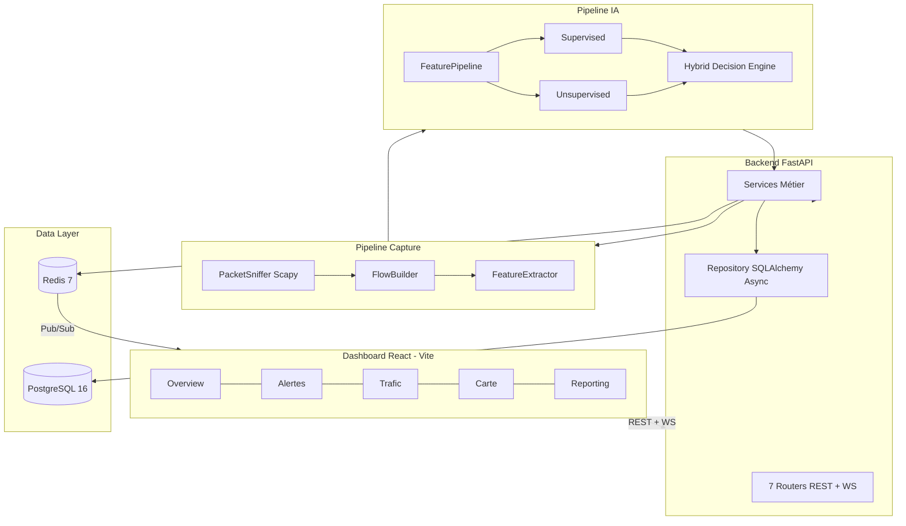

# 🛡️ Network Defense System (NDS)

Plateforme SOC (Security Operations Center) de détection d'intrusions réseau en temps réel, combinant capture réseau bas-niveau, intelligence artificielle hybride (supervisée + non supervisée + réputation IP), backend asynchrone, dashboard interactif et reporting piloté par LLM.


---

## ✨ Fonctionnalités Clés

| Composant | Description |
|-----------|-------------|
| 📡 **Capture Réseau** | Sniffing Scapy en thread dédié avec buffer circulaire (`deque`), fallback BPF/L2/L3, agrégation en flux bidirectionnels 5-tuple canonique, extraction de ~80 features CIC-compatibles |
| 🧠 **IA Hybride** | Classification supervisée (MLP Keras multi-classe) + détection d'anomalies non supervisée (Auto-Encodeur, seuil μ+3σ) + réputation IP, fusion pondérée (50/30/20) via `HybridDecisionEngine` |
| 📊 **Dashboard Temps Réel** | React 18 + Vite 6, 6 vues (Overview, Alertes, Trafic, Carte Leaflet, Reporting, Settings), WebSocket `/ws/alerts` via Redis Pub/Sub |
| 📝 **Reporting LLM** | Pipeline 7 étapes (métriques → tendances → threat index → prompt → LLM → formatage → PDF), supports Ollama et Groq/OpenAI-compatible |
| ⚡ **Backend Async** | FastAPI + SQLAlchemy 2.0 async (asyncpg) + Redis 7, rate limiting SlowAPI, CORS configurable, healthchecks Docker |
| 💾 **Persistance** | PostgreSQL 16, 7 tables (flows, predictions, anomaly_scores, alerts, ip_geolocation, model_versions, feedback_labels), rétention automatique configurable |

---

## 🏗️ Architecture Haut Niveau



---

## 🚀 Démarrage Rapide

### Prérequis
- **Docker Desktop** (orchestre Backend + PostgreSQL + Redis)
- **Node.js 18+** (dashboard React)
- *(Optionnel)* Artefacts IA dans `ai/artifacts/` — le backend fonctionne en mode dégradé s'ils sont absents

### 1. Lancer le Backend

```bash
git clone https://github.com/meedvfx/Network-Defense-System.git
cd Network-Defense-System
docker compose up --build -d
```

Vérifier : `docker compose ps` — les 3 services doivent être `healthy`.

| Service | Container | Port |
|---------|-----------|------|
| PostgreSQL 16 | `nds-postgres` | 5432 |
| Redis 7 | `nds-redis` | 6379 |
| FastAPI Backend | `nds-backend` | 8000 |

### 2. Lancer le Dashboard

```bash
cd dashboard
npm install
npm run dev
```

### 3. Accès

| Interface | URL |
|-----------|-----|
| Dashboard | http://localhost:3000 |
| API Backend | http://localhost:8000 |
| Swagger UI | http://localhost:8000/docs |
| ReDoc | http://localhost:8000/redoc |
| Health Check | http://localhost:8000/health |

### 4. Mode Développement Local (sans Docker pour le backend)

```bash
# Lancer uniquement DB + Redis
docker compose up postgres redis -d

# Environnement Python
python -m venv .venv && .\.venv\Scripts\Activate.ps1
pip install -r requirements.txt

# Lancer le backend
uvicorn backend.main:app --host 0.0.0.0 --port 8000 --reload
```

---

## 📂 Structure du Projet

```
Network-Defense-System/
├── ai/                     # Pipeline IA (inférence uniquement)
│   ├── artifacts/          # Modèles pré-entraînés (.keras, .pkl)
│   ├── config/             # model_config.py (chemins, seuils, poids)
│   ├── inference/          # model_loader, supervised/unsupervised predictor, hybrid_decision_engine
│   └── preprocessing/      # data_validator, feature_pipeline
├── backend/                # Serveur FastAPI
│   ├── main.py             # App, lifespan, CORS, rate limiter, routes
│   ├── api/                # 7 routers + websocket_handler
│   ├── core/               # config.py, security.py, exceptions
│   ├── database/           # connection, models (7 ORM), repository, redis_client
│   └── services/           # detection, capture, alert, geo, data_retention
├── capture/                # Couche réseau bas-niveau
│   ├── packet_sniffer.py   # Thread Scapy + buffer circulaire (269 lignes)
│   ├── flow_builder.py     # Agrégation 5-tuple canonique + timeout
│   └── feature_extractor.py # ~80 features CIC-compatibles
├── dashboard/              # Frontend React 18 + Vite 6
│   └── src/App.jsx         # Application monolithique (40K)
├── reporting/              # Pipeline reporting LLM
│   ├── report_controller.py # Orchestrateur principal
│   ├── metrics_engine.py   # Extraction métriques DB
│   ├── trend_analysis.py   # Comparaison période vs N-1
│   ├── threat_index.py     # Calcul indice de menace (0-100)
│   ├── prompt_builder.py   # Construction prompt JSON-safe
│   ├── llm_engine.py       # Appel Ollama / Groq
│   ├── report_formatter.py # Markdown structuré
│   └── pdf_exporter.py     # Export PDF via fpdf2
├── geo/                    # Géolocalisation IP (ip-api.com)
├── monitoring/             # Logger rotatif + SystemMetrics (psutil)
├── docker-compose.yml      # 3 services, réseau nds-network, healthchecks
├── Dockerfile              # python:3.11-slim + libpcap + tcpdump
├── requirements.txt        # 44 dépendances pinées
└── .env                    # ~30 variables de configuration
```

---

## 📡 API REST (Routes Exposées)

### Système
| Méthode | Endpoint | Description |
|---------|----------|-------------|
| `GET` | `/` | Info service (nom, version, status) |
| `GET` | `/health` | Health check (API + DB + Redis) avec timeout 1.5s |
| `WS` | `/ws/alerts` | Streaming alertes temps réel via Redis Pub/Sub |

### Détection (`/api/detection`)
| Méthode | Endpoint | Description |
|---------|----------|-------------|
| `POST` | `/analyze` | Analyse d'un vecteur de features |
| `GET` | `/status` | État moteur IA (artifacts chargés) |
| `POST` | `/capture/start` | Démarrage capture avec fallback auto |
| `POST` | `/capture/stop` | Arrêt capture |
| `GET` | `/capture/status` | Stats (paquets, buffer, flows actifs, interfaces) |
| `GET` | `/capture/interfaces` | Interfaces réseau détectées par Scapy |
| `POST` | `/capture/interface` | Changement interface |

### Alertes (`/api/alerts`)
| Méthode | Endpoint | Description |
|---------|----------|-------------|
| `GET` | `/` | Liste alertes (filtres sévérité/statut + pagination) |
| `PATCH` | `/{alert_id}/status` | Transition statut (open → acknowledged → resolved) |
| `GET` | `/stats` | Ventilation par sévérité sur N heures |
| `GET` | `/top-ips` | Top IPs attaquantes (Top Talkers) |

### Dashboard (`/api/dashboard`)
| Méthode | Endpoint | Description |
|---------|----------|-------------|
| `GET` | `/overview` | KPIs globaux |
| `GET` | `/attack-distribution` | Répartition camembert types attaques |
| `GET` | `/top-threats` | Top menaces |
| `GET` | `/recent-alerts` | Dernières alertes |
| `GET` | `/metrics` | Compteurs + jauges + santé système (psutil) |
| `GET` | `/traffic-timeseries` | Série temporelle trafic |
| `GET` | `/protocol-distribution` | Répartition TCP/UDP/ICMP |

### Géolocalisation (`/api/geo`)
| Méthode | Endpoint | Description |
|---------|----------|-------------|
| `GET` | `/locate/{ip}` | Géolocalisation unitaire |
| `POST` | `/locate-batch` | Géolocalisation batch |
| `GET` | `/attack-map` | Données carte des attaques |
| `GET` | `/cached` | Cache géolocalisation DB |

### Modèles (`/api/models`)
| Méthode | Endpoint | Description |
|---------|----------|-------------|
| `GET` | `/status` | Présence et état des artefacts IA |
| `GET` | `/config` | Paramètres d'inférence exposés |

### Feedback (`/api/feedback`)
| Méthode | Endpoint | Description |
|---------|----------|-------------|
| `POST` | `/` | Soumission feedback analyste |
| `GET` | `/stats` | Compteur feedbacks |
| `GET` | `/unused` | Feedbacks non exploités pour entraînement |

### Reporting (`/api/reporting`) — 🔐 Protégé par `X-API-Key`
| Méthode | Endpoint | Description |
|---------|----------|-------------|
| `POST` | `/generate` | Génération rapport SOC (params: `period_hours`, `detail_level`, `export_format`) |

---

## ⚙️ Configuration (`.env`)

| Catégorie | Variables | Exemple |
|-----------|-----------|---------|
| **Application** | `APP_NAME`, `APP_ENV`, `APP_DEBUG`, `APP_HOST`, `APP_PORT`, `SECRET_KEY` | `APP_PORT=8000` |
| **PostgreSQL** | `DB_HOST`, `DB_PORT`, `DB_NAME`, `DB_USER`, `DB_PASSWORD` | `DB_HOST=localhost` |
| **Redis** | `REDIS_HOST`, `REDIS_PORT`, `REDIS_DB` | `REDIS_PORT=6379` |
| **GeoIP** | `GEOIP_PROVIDER`, `GEOIP_API_KEY`, `GEOIP_CACHE_TTL` | `GEOIP_PROVIDER=ip-api` |
| **IA** | `MODEL_DIR`, `SUPERVISED_MODEL_VERSION`, `ANOMALY_THRESHOLD_K` | `ANOMALY_THRESHOLD_K=3.0` |
| **Capture** | `CAPTURE_INTERFACE`, `CAPTURE_BUFFER_SIZE`, `CAPTURE_FLOW_TIMEOUT` | `CAPTURE_INTERFACE=auto` |
| **Sécurité** | `API_KEY`, `CORS_ORIGINS`, `RATE_LIMIT_PER_MINUTE` | `RATE_LIMIT_PER_MINUTE=60` |
| **Rétention** | `RETENTION_ENABLED`, `RETENTION_FLOWS_DAYS`, `RETENTION_DELETE_BATCH_SIZE`, `RETENTION_KEEP_ALERTED_FLOWS` | `RETENTION_FLOWS_DAYS=30` |
| **LLM** | `LLM_PROVIDER`, `LLM_MODEL`, `OLLAMA_BASE_URL`, `GROQ_API_KEY` | `LLM_PROVIDER=groq` |

> En Docker, `DB_HOST` et `REDIS_HOST` sont automatiquement surchargés par `docker-compose.yml` vers les noms de service (`postgres`, `redis`).

---

## 📚 Documentation Complémentaire

| Document | Contenu |
|----------|---------|
| [Architecture détaillée](docs/ARCHITECTURE.md) | Diagrammes Mermaid, flux de données, schéma BDD, pipeline IA, matrice de décision |
| [Problématique Cyber](docs/PROBLEM_STATEMENT.md) | Limites des IDS signatures, approche comportementale Flow-Based |
| [Guide d'Entraînement IA](docs/TRAINING_GUIDE.md) | Scripts Colab, artefacts requis, checklist déploiement |
| [Guide Utilisateur](docs/USER_GUIDE.md) | Navigation dashboard, gestion alertes, feedback, reporting |
| [Détails Techniques](docs/PROJECT_DETAILS.md) | Stack exhaustive, sécurité, limites connues |

---

## 📜 Licence

Projet sous licence **MIT** — voir `LICENSE`.
