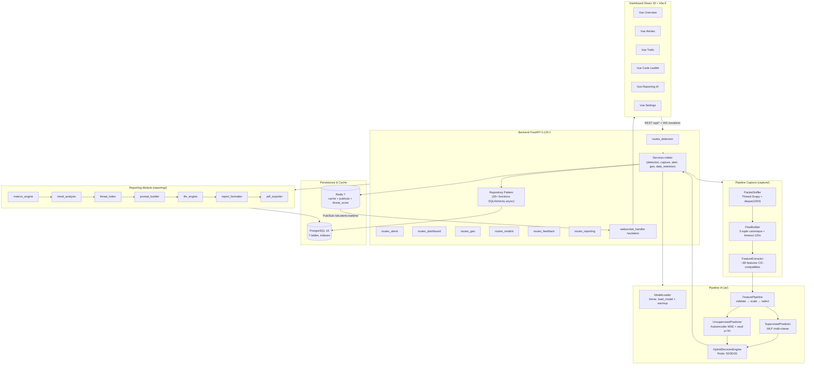
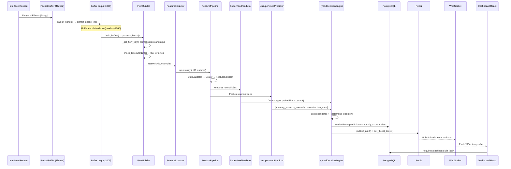
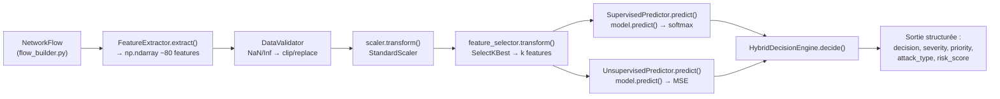
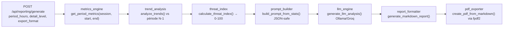
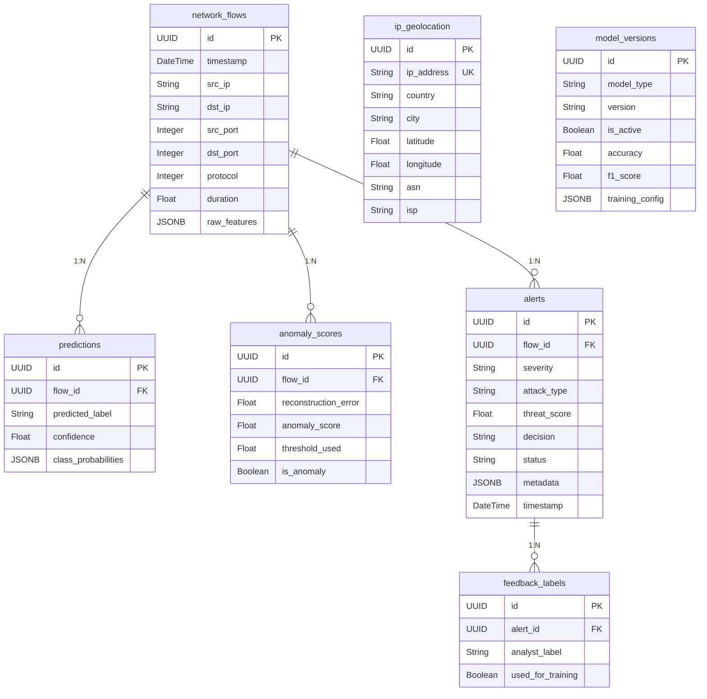

# 🏗️ Architecture Détaillée — Network Defense System

Ce document fournit la documentation technique approfondie de l'architecture NDS, basée sur l'analyse directe du code source.

---

## 1. Architecture Système Complète



### 1.1 Principes d'Architecture

| Principe | Implémentation |
|----------|----------------|
| **Séparation des couches** | 6 modules indépendants : `backend/`, `ai/`, `capture/`, `reporting/`, `geo/`, `monitoring/` |
| **Asynchronisme** | FastAPI + SQLAlchemy 2.0 async (asyncpg) + Redis async (`aioredis`) |
| **Tolérance aux pannes** | Fallbacks sur DB/Redis/Geo/LLM/AI — chaque service vérifie sa disponibilité au `lifespan` |
| **Singleton services** | `detection_service`, `capture_service`, `alert_service` utilisent des instances globales de module |
| **Configuration centralisée** | `Pydantic BaseSettings` avec `@lru_cache` singleton + `.env` auto-chargé |

---

## 2. Flux de Données End-to-End



### 2.1 Détail des Transactions de Persistance

Pour chaque flux analysé, le `detection_service` persiste dans une seule transaction :

1. **`network_flows`** — Le flux réseau brut (5-tuple, durée, timestamps)
2. **`predictions`** — Résultat supervisé (label prédit, confiance, probabilités par classe)
3. **`anomaly_scores`** — Résultat non supervisé (erreur reconstruction, score anomalie, seuil utilisé, booléen `is_anomaly`)
4. **`alerts`** — Créée **uniquement** si `decision != "normal"` (sévérité, type, threat_score, metadata JSON)

### 2.2 Publication Temps Réel

L'`alert_service.create_alert()` publie chaque alerte sur le canal Redis `nds:alerts:realtime` (sérialisée JSON avec timestamp ISO). Le `websocket_handler` souscrit à ce canal et relaye vers tous les clients WebSocket connectés au endpoint `/ws/alerts`.

---

## 3. Pipeline IA — Inférence Exclusive

> ⚠️ **L'entraînement n'est PAS exécuté dans cette application.** Les modèles sont entraînés séparément (Colab/Jupyter) et les artefacts sont déposés dans `ai/artifacts/`.

### 3.1 Artefacts Requis

| Artefact | Format | Rôle dans le Pipeline | Vérifié par |
|----------|--------|----------------------|-------------|
| `model_supervised.keras` | Keras SavedModel | Réseau de neurones classifieur multi-classe | `ArtifactPaths.supervised_model` |
| `model_unsupervised.keras` | Keras SavedModel | Auto-encodeur (détection anomalies) | `ArtifactPaths.unsupervised_model` |
| `scaler.pkl` | Joblib | `StandardScaler` pré-fitté | `ArtifactPaths.scaler` |
| `encoder.pkl` | Joblib | `LabelEncoder` des classes d'attaques | `ArtifactPaths.encoder` |
| `feature_selector.pkl` | Joblib | `SelectKBest` réduction dimensionnelle | `ArtifactPaths.feature_selector` |
| `threshold_stats.pkl` | Joblib | Dict `{mean, std, threshold}` pour seuil anomalie | Chargé optionnellement par `UnsupervisedPredictor` |

La vérification de présence est effectuée par `ArtifactPaths.all_exist()` et `ArtifactPaths.missing_artifacts()` dans `ai/config/model_config.py`.

### 3.2 Chaîne de Traitement Détaillée



### 3.3 Configuration d'Inférence (`InferenceConfig`)

Extraits de `ai/config/model_config.py` — paramètres effectivement utilisés :

| Paramètre | Valeur par Défaut | Rôle |
|-----------|-------------------|------|
| `anomaly_threshold_k` | `3.0` | Multiplicateur pour seuil dynamique (μ + k×σ) |
| `min_classification_confidence` | `0.5` | Confiance minimale pour accepter une classification |
| `weight_supervised` | `0.50` | Poids du supervisé dans le score final |
| `weight_unsupervised` | `0.30` | Poids du non-supervisé |
| `weight_reputation` | `0.20` | Poids de la réputation IP |
| `threshold_attack` | `0.7` | Score ≥ 0.7 → attaque confirmée |
| `threshold_suspicious` | `0.4` | 0.4 ≤ Score < 0.7 → suspect |
| `batch_size` | `64` | Taille de batch pour inférence optimisée |
| `warmup_on_load` | `True` | Inférence factice au démarrage pour charger le graphe TF |

### 3.4 Formule de Score de Risque Final

```
final_risk_score = w_sup × supervised_risk + w_unsup × anomaly_score + w_rep × ip_reputation
```

Avec normalisation des poids (somme = 1.0) et bornage final dans `[0.0, 1.0]`.

`supervised_risk` = probabilité si `is_attack=True`, sinon `1.0 - probabilité`.

### 3.5 Matrice de Décision (`_determine_decision`)

| `is_attack` (Supervisé) | `is_anomaly` (Non-Supervisé) | Décision |
|--------------------------|-------------------------------|----------|
| ✅ `True` | ✅ `True` | `confirmed_attack` |
| ✅ `True` | ❌ `False` | `confirmed_attack` si confiance ≥ 0.8, sinon `suspicious` |
| ❌ `False` | ✅ `True` | `unknown_anomaly` |
| ❌ `False` | ❌ `False` | `suspicious` si `final_risk_score ≥ threshold_attack`, sinon `normal` |

### 3.6 Mappage Sévérité (`SeverityConfig`)

| Score de Risque | Sévérité |
|-----------------|----------|
| ≥ 0.85 | `critical` |
| ≥ 0.65 | `high` |
| ≥ 0.40 | `medium` |
| < 0.40 | `low` |

### 3.7 Matrice de Priorité Opérationnelle (`_compute_priority`)

La priorité (1 = critique urgent, 5 = routine) est calculée par le couple `(sévérité, décision)` :

| Sévérité | confirmed_attack | unknown_anomaly | suspicious |
|----------|-----------------|-----------------|------------|
| critical | 1 | 1 | 2 |
| high | 2 | 2 | 3 |
| medium | 3 | 3 | 4 |
| Autre | 5 | 5 | 5 |

---

## 4. Pipeline Capture Réseau

### 4.1 PacketSniffer (`capture/packet_sniffer.py` — 269 lignes)

| Caractéristique | Implémentation |
|-----------------|----------------|
| **Moteur** | Scapy `sniff()` avec filtre BPF `"ip"` |
| **Threading** | Daemon thread dédié (`_sniff_loop`) |
| **Buffer** | `collections.deque(maxlen=buffer_size)` — circulaire, overflow silencieux |
| **Fallback** | 3 niveaux : BPF natif → sans filtre BPF → socket L3 (`conf.L3socket`) |
| **Extraction** | `_extract_packet_info()` → dict {src_ip, dst_ip, src_port, dst_port, protocol, size, flags, timestamp} |
| **Interface** | Auto-détection via Scapy ou spécification manuelle (eth0, wlan0, Wi-Fi) |
| **OS** | Gestion Windows (Npcap) + Linux native |

### 4.2 FlowBuilder (`capture/flow_builder.py` — 196 lignes)

- **Clé canonique** : `_get_flow_key()` trie les tuples (IP, Port) pour que A→B et B→A partagent la même clé
- **Timeout** : `flow_timeout` secondes d'inactivité (défaut 120s) avant clôture automatique
- **Direction** : `NetworkFlow._add_packet()` détermine Forward/Backward en comparant `src_ip`
- **Complétude** : `is_complete` = trafic bidirectionnel (fwd > 0 et bwd > 0)

### 4.3 FeatureExtractor (`capture/feature_extractor.py` — 257 lignes)

Extrait ~80 features CIC-IDS2017 compatibles par flux :

| Catégorie | Features calculées |
|-----------|--------------------|
| **Volumétrie** | Total Fwd/Bwd packets, Total Length Fwd/Bwd, Flow Bytes/s, Flow Packets/s |
| **Taille paquets** | Mean/Std/Max/Min pour Forward et Backward séparément |
| **IAT** (Inter-Arrival Time) | Mean/Std/Max/Min pour Flow entier, Forward, Backward |
| **Drapeaux TCP** | Compteurs FIN, SYN, RST, PSH, ACK, URG, ECE, CWR par direction |
| **Dérivées** | Down/Up ratio, Average Packet Size, Fwd/Bwd Segment Size Avg |
| **Statistiques** | `_safe_stats()` gère les listes vides (retourne 0 pour mean/std/max/min) |

---

## 5. Module Reporting LLM

### 5.1 Architecture Pipeline

Le `ReportingController` orchestre un pipeline séquentiel en 7 étapes :



### 5.2 Providers LLM Supportés

- **Groq** (défaut configuré dans `.env`) : Via `openai.AsyncOpenAI` avec endpoint compatible
- **Ollama** : Appel HTTP direct sur `/api/generate`
- **Structure attendue** : JSON contenant `executive_summary`, `technical_analysis`, `attacker_behavior`, `recommendations`
- **Robustesse** : Fallback appliqué si LLM indisponible ou réponse JSON invalide

### 5.3 Formats d'Export

| Format | Module | Sortie |
|--------|--------|--------|
| `json` | Retour direct | Dict avec period, threat_index, metrics, trends, llm_analysis |
| `markdown` | `report_formatter.py` | Rapport Markdown structuré |
| `pdf` | `pdf_exporter.py` | Fichier PDF via fpdf2 |

---

## 6. Schéma de Base de Données

### 6.1 Modèles ORM (7 tables)



### 6.2 Index de Performance

| Table | Index | Colonnes |
|-------|-------|----------|
| `network_flows` | `idx_flows_timestamp_desc` | `timestamp DESC` |
| `network_flows` | `idx_flows_src_dst` | `src_ip, dst_ip` |
| `alerts` | `idx_alerts_severity_time` | `severity, timestamp DESC` |
| `model_versions` | `idx_model_active` | `model_type, is_active` |
| `feedback_labels` | `idx_feedback_unused` | `used_for_training` |

### 6.3 Repository Pattern

Le fichier `backend/database/repository.py` expose **35+ fonctions** async couvrant toutes les opérations CRUD :
- **Flows** : `create_flow`, `create_flow_batch` (bulk insert), `get_recent_flows`, `count_flows`
- **Predictions** : `create_prediction`, `get_prediction_by_flow`, `get_attack_distribution` (pie chart)
- **Anomalies** : `create_anomaly`, `get_anomalies`, `get_anomaly_rate` (ratio anomal/total)
- **Alertes** : `create_alert`, `get_alerts` (filtres + pagination), `update_alert_status`, `get_alert_stats`, `get_top_alert_ips`
- **GeoIP** : `upsert_geolocation`, `get_geolocation_by_ip`, `get_all_geolocations`
- **MLOps** : `create_model_version`, `get_active_model_version`, `set_active_model_version`
- **Feedback** : `create_feedback`, `get_unused_feedbacks`, `mark_feedback_used`

---

## 7. Conteneurisation Docker

### 7.1 Services (`docker-compose.yml`)

| Service | Image | Container | Port | Healthcheck |
|---------|-------|-----------|------|-------------|
| PostgreSQL | `postgres:16-alpine` | `nds-postgres` | 5432 | `pg_isready -U nds_user` |
| Redis | `redis:7-alpine` | `nds-redis` | 6379 | `redis-cli ping` |
| Backend | Build local (`Dockerfile`) | `nds-backend` | 8000 | HTTP `/health` |

### 7.2 Configuration Docker

- **Réseau** : `nds-network` (bridge) — communication inter-services par nom DNS
- **Volumes persistants** : `postgres_data`, `redis_data`
- **Volume bind-mount** : `./ai/artifacts:/app/ai/artifacts` (artefacts IA), `./logs:/app/logs`
- **Redis** : `--appendonly yes --maxmemory 256mb --maxmemory-policy allkeys-lru`
- **Backend depends_on** : `postgres` et `redis` avec `condition: service_healthy`
- **Env override** : `DB_HOST=postgres`, `REDIS_HOST=redis` surchargent les valeurs `.env`

### 7.3 Dockerfile

Base `python:3.11-slim` avec dépendances système :
- `libpcap-dev` + `tcpdump` (Scapy capture)
- `libpq-dev` + `gcc` (asyncpg/psycopg2 compilation)

---

## 8. Observabilité

### 8.1 Logging (`monitoring/logger.py`)

4 handlers configurés :
- Console (stdout)
- Fichier principal rotatif
- Fichier erreurs rotatif
- Fichier sécurité (warnings+)

### 8.2 Métriques Système (`monitoring/metrics.py`)

Classe `SystemMetrics` — singleton global :

| Type | Métriques |
|------|-----------|
| **Compteurs** | `packets_processed`, `flows_analyzed`, `alerts_generated`, `predictions_made`, `anomalies_detected` |
| **Jauges** | `current_threat_score`, `active_flows`, `buffer_usage` |
| **Système** | CPU %, RAM (total/used/%), Disque (total/used %), Uptime (via `psutil`) |

### 8.3 Health Check (`/health`)

Vérifie DB et Redis avec timeout `asyncio.wait_for(1.5s)` chacun :
```json
{
  "status": "healthy",
  "services": {
    "api": true,
    "database": true,
    "redis": true
  }
}
```
