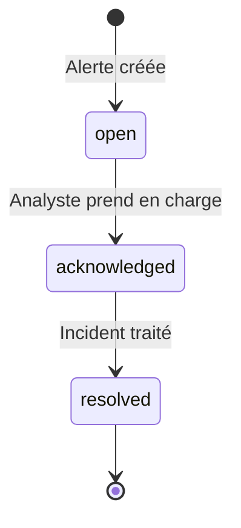

# 📖 Guide Utilisateur — Network Defense System

Guide d'utilisation du dashboard NDS pour les analystes SOC. Couvre la navigation, l'interprétation des données, la gestion des alertes, le feedback IA, et la génération de rapports.

---

## 🖥️ Accès au Dashboard

| Service | URL | Prérequis |
|---------|-----|-----------|
| Dashboard | http://localhost:3000 | `cd dashboard && npm run dev` |
| API Backend | http://localhost:8000 | `docker compose up -d` |
| Swagger Docs | http://localhost:8000/docs | Backend actif |

Le proxy Vite redirige automatiquement `/api/*` et `/ws/*` vers le backend (port 8000).

---

## 📊 Vue Overview (Tableau de Bord Principal)

La vue d'ensemble consolide les indicateurs clés via l'endpoint `GET /api/dashboard/overview`.

### Threat Score (Jauge Globale)

Score dynamique de 0 à 100 stocké dans Redis (`nds:threat_score`), mis à jour par `alert_service.update_threat_score()` à chaque nouvelle détection.

| Plage | Niveau | Signification |
|-------|--------|---------------|
| 🟢 0-30 | Normal | Activité réseau saine, aucune menace significative |
| 🟡 30-70 | Vigilance | Alertes mineures ou activité suspecte détectée par l'Explorateur (non-supervisé) |
| 🔴 70-100 | Critique | Attaques confirmées en cours, intrusions multiples, DDoS actif |

### KPIs Affichés
- Total des flux analysés (compteur `flows_analyzed`)
- Total des alertes générées (compteur `alerts_generated`)
- Taux d'anomalie (ratio flux anormaux / total via `get_anomaly_rate()`)
- Score de menace courant (Redis)

### Graphique Trafic Temps Réel
Série temporelle via `GET /api/dashboard/traffic-timeseries` superposant :
- **Normal** (vert) — Flux classés BENIGN
- **Suspect** (orange) — Flux flaggés `suspicious` ou `unknown_anomaly`
- **Attaque** (rouge) — Flux classés `confirmed_attack`

---

## 🚨 Vue Alertes

Liste paginée des alertes via `GET /api/alerts` avec filtres par sévérité et statut.

### Anatomie d'une Alerte

| Champ | Source | Description |
|-------|--------|-------------|
| **ID** | UUID v4 auto-généré | Identifiant unique de l'alerte |
| **Timestamp** | `datetime.utcnow()` | Horodatage UTC de détection |
| **Sévérité** | `SeverityConfig.get_severity()` | `critical` (≥0.85), `high` (≥0.65), `medium` (≥0.40), `low` |
| **Type d'Attaque** | `SupervisedPredictor` | Ex: `DoS Hulk`, `PortScan`, `SSH-Patator` — ou `None` si anomalie pure |
| **Décision IA** | `HybridDecisionEngine` | `confirmed_attack`, `suspicious`, `unknown_anomaly` |
| **Threat Score** | `final_risk_score` | Score combiné [0.0, 1.0] |
| **Priorité** | `_compute_priority()` | 1 (urgence maximale) à 5 (routine) |
| **IP Source / Dest** | `flow_metadata` | Tuples réseau concernés |
| **Confiance Supervisée** | `supervised_confidence` | Probabilité de la classification (0-100%) |
| **Score Anomalie** | `anomaly_score` | Score de déviation non-supervisée |

### Cycle de Vie des Alertes

Transition via `PATCH /api/alerts/{alert_id}/status` avec `new_status`.

### Top Attaquants
`GET /api/alerts/top-ips` identifie les IPs sources générant le plus d'alertes sur les dernières N heures (Top Talkers).

---

## 🗺️ Vue Carte des Menaces

Carte interactive Leaflet/OpenStreetMap affichant les origines géographiques des IP attaquantes.

- **Données** : `GET /api/geo/attack-map`
- **Géolocalisation** : Via `ip-api.com` avec cache PostgreSQL (`ip_geolocation`)
- **IPs privées** (192.168.x.x, 10.x.x.x) : Affichées comme "Local Network" — non positionnables sur la carte

---

## 📈 Vue Trafic

Consolidation graphique du réseau via :
- `GET /api/dashboard/traffic-timeseries` — Volume de trafic par tranche temporelle
- `GET /api/dashboard/protocol-distribution` — Répartition TCP / UDP / ICMP
- `GET /api/dashboard/attack-distribution` — Camembert des types d'attaques (pie chart)

---

## 🔄 Feedback Analyste (Active Learning)

Le système collecte les retours des analystes pour améliorer les futurs entraînements IA.

### Workflow

1. **Examiner** une alerte en détail
2. **Étiqueter** via `POST /api/feedback` :
   - **True Positive** — L'IA a correctement identifié une attaque
   - **False Positive** — L'alerte est un faux positif (trafic légitime)
3. **Stocker** — Le feedback est persisté dans `feedback_labels` (PostgreSQL)
4. **Exploiter** — Lors du prochain entraînement, `GET /api/feedback/unused` retourne les labels à intégrer

> Les feedbacks sont marqués `used_for_training = false` par défaut. Après intégration dans un entraînement, ils passent à `true`.

---

## 📝 Vue Reporting (Génération LLM)

### Générer un Rapport

1. Sélectionner la **période** : 24h, 7 jours (168h), ou 30 jours (720h)
2. Choisir le **niveau de détail** :
   - `Technical` — Pour les ingénieurs sécurité (détails techniques, IoCs)
   - `Executive` — Pour le management (résumé exécutif, risques business)
3. Choisir le **format d'export** :
   - `json` — Données brutes structurées (métriques + analyse LLM)
   - `markdown` — Rapport formaté lisible
   - `pdf` — Document PDF téléchargeable
4. **Lancer** — Le backend exécute le pipeline complet (métriques → tendances → threat index → prompt → LLM → formatage)

### Contenu du Rapport
Le LLM (Groq/Ollama) génère :
- **Résumé Exécutif** — Vue d'ensemble de la posture de sécurité
- **Analyse Technique** — Détails des attaques détectées, patterns observés
- **Comportement Attaquants** — Profils et tactiques identifiées
- **Recommandations** — Actions correctives proposées

> ⚠️ L'endpoint `POST /api/reporting/generate` est protégé par le header `X-API-Key`.

---

## 🔧 Dépannage

### Le dashboard n'affiche aucune donnée

1. **Vérifier le backend** : http://localhost:8000/health doit retourner `"status": "healthy"` avec `database: true` et `redis: true`
2. **Vérifier Docker** : `docker compose ps` — les 3 services doivent être `healthy`
3. **Vérifier les logs** : `docker compose logs -f backend`

### Les modèles IA ne sont pas chargés

1. Vérifier : http://localhost:8000/api/models/status
2. Si `"missing"` contient des fichiers → déposer les artefacts dans `ai/artifacts/`
3. Redémarrer : `docker compose restart backend`

### Les IPs apparaissent comme "Local"

C'est normal pour les IPs privées (RFC 1918). Le module `ip_resolver.py` classifie les subnets 10.0.0.0/8, 172.16.0.0/12, et 192.168.0.0/16 comme non-géolocalisables.

### La capture réseau ne démarre pas

1. **Linux** : Vérifier les permissions (`sudo` ou capability `CAP_NET_RAW`)
2. **Windows** : Installer **Npcap** (https://npcap.com)
3. **Docker** : Le conteneur utilise `libpcap-dev` + `tcpdump` — la capture fonctionne sur l'interface du container
4. Vérifier les interfaces disponibles : `GET /api/detection/capture/interfaces`
